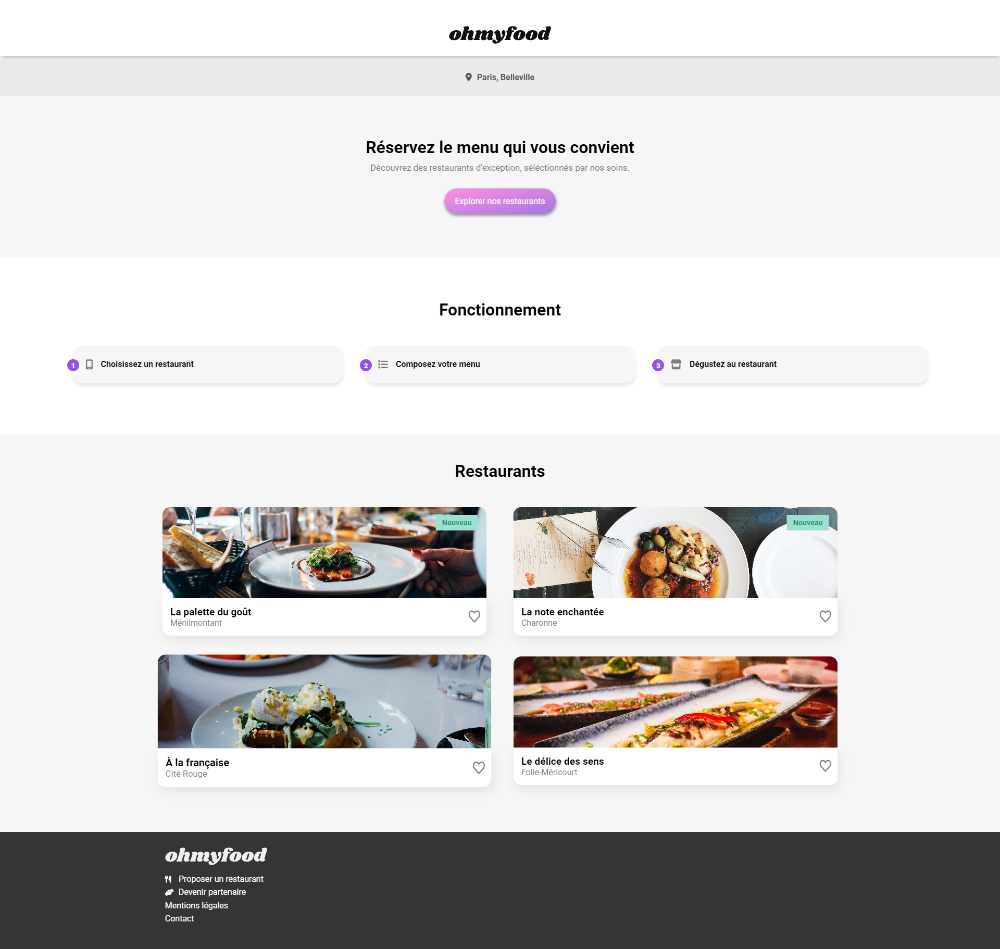
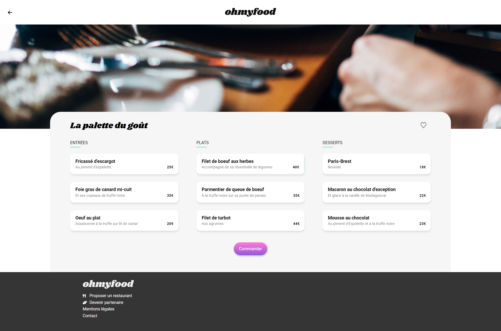

# OCR---P3-Ohmyfood
Project live at https://achanty.github.io/OCR---P3-Ohmyfood/

## Table of contents

-  [Overview](#overview)
   -  [Screenshots](#screenshots)
   -  [Links](#links)
-  [My process](#my-process)
   -  [Built with](#built-with)
-  [Author](#author)

## Overview

### Screenshots

### Links

-  Live Site URL: https://achanty.github.io/OCR---P3-Ohmyfood/

## My process

### Built with

-  Semantic HTML5 markup
-  CSS custom properties
-  CSS animations
-  Sass preprocessor
-  Mobile-first workflow

## Author

-  Linkedin - [Anthony Chanty](https://www.linkedin.com/in/anthony-c-a925a6172/)
-  Frontend Mentor - [@achanty](https://www.frontendmentor.io/profile/AChanty)
